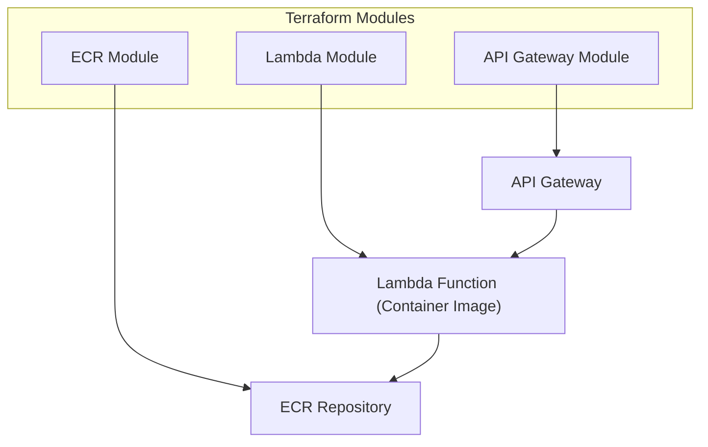
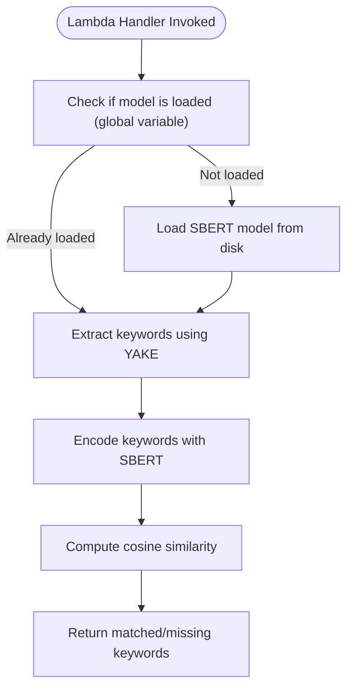

# Lessons Learned from Deploying Large ML Models in AWS Lambda Containers

Deploying large ML models serverlessly in AWS Lambda was something I thought would be straightforward. Spoiler: it wasn't. I ran into cold start issues, timeout errors, and Docker image size bloat. But I also came away with a much deeper understanding of how to do it right.

This post is a breakdown of everything I learned while deploying a ~6GB sentence-transformer model using Lambda containers, complete with a Terraform-managed infrastructure, a multi-stage Docker build, and some careful Python architecture.

---

## The Problem

I needed to run a sentence similarity algorithm that involved:

- Extracting keywords with YAKE
- Encoding those keywords using a Sentence-BERT model (`all-MiniLM-L6-v2`)
- Comparing job descriptions and resumes in real time

Lambda was appealing because it offered a pay-per-request model and simple scaling. But the model size and dependencies made cold starts and init phase behavior a serious challenge.

---

## Lambda’s Init Phase vs Handler Execution

The biggest technical gotcha I faced was understanding the **difference between Lambda's init phase and the invocation (handler) phase**.

Here’s what I learned:

- Code outside the handler (`lambda_handler`) runs during the **init phase**, which has a **hard 10-second limit**
- Code inside the handler runs during the **invoke phase**, which respects the full timeout you configure (e.g. 120 seconds)

### What Went Wrong

At first, I loaded my model at the global scope, thinking it would make warm starts faster. But this caused my Lambda to timeout during the init phase:

```text
INIT_REPORT Init Duration: 10001.15 ms Phase: init Status: timeout
````

And the only HTTP response I got?

```json
{ "message": "Service Unavailable" }
```

### What Fixed It

I moved the model loading into the handler function, so the first invocation pays the loading cost, **not the init phase**:

```python
model = None

def get_model():
    global model
    if model is None:
        model = SentenceTransformer(MODEL_PATH)
    return model

def lambda_handler(event, context):
    model = get_model()
    ...
```

This change alone fixed the 503 errors and made cold starts predictable.

---

## Using Global Variables Smartly

I used a global variable for the model, and one for the keyword extractor (`yake.KeywordExtractor`), so that after the first invocation, warm requests reuse these heavy objects.

It’s important to **not** instantiate these objects inside the handler every time:

```python
# DO NOT DO THIS
def lambda_handler(event, context):
    model = SentenceTransformer(MODEL_PATH)  # very slow
```

Instead:

```python
model = None
kw_extractor = yake.KeywordExtractor()

def lambda_handler(event, context):
    ...
```

This gave me massive performance gains on warm invocations.

---

## Architecture Overview

Here’s a high-level view of how all the pieces fit together:

### Figure 1: Terraform-Based Deployment Architecture


### Figure 2: Lambda Runtime Flow


---

## Multi-Stage Docker Build to Slim Down Image Size

My first Docker image was nearly 9GB. This made cold starts long and uploads painful. By moving to a **multi-stage Dockerfile**, I:

* Installed all packages in a builder stage
* Cached the model from Hugging Face into `/opt/sbert-model`
* Copied only necessary binaries and files into the final image

The result? A \~6GB image that avoided runtime downloads and stayed below the Lambda 10GB limit.

I also set these environment variables to ensure the model didn’t re-download:

```dockerfile
ENV HF_HOME=/opt/sbert-model
ENV TRANSFORMERS_CACHE=/opt/sbert-model
ENV XDG_CACHE_HOME=/opt/sbert-model
```

---

## Infrastructure as Code with Terraform

To manage the deployment cleanly, I used Terraform with a **modular structure**:

### Module Layout

```
infrastructure/
├── main.tf
├── variables.tf
├── outputs.tf
├── modules/
│   ├── lambda/
│   ├── api_gateway/
│   └── ecr/
```

Each module had a clear responsibility:

* **Lambda module**: Defines the container-based Lambda function with appropriate IAM role and memory/timeout settings.
* **ECR module**: Builds and uploads the Docker image to a private ECR repository.
* **API Gateway module**: Routes HTTP requests to the Lambda.

### Example: Lambda Configuration

In `main.tf`, I set:

```hcl
resource "aws_lambda_function" "this" {
  function_name = var.function_name
  package_type  = "Image"
  image_uri     = var.image_uri
  role          = aws_iam_role.lambda_exec.arn
  timeout       = 120
  memory_size   = 5000
}
```

This gave me enough time and memory to comfortably run inference on warm and cold invocations.

---

## Logging: Detecting Cold Starts

To verify whether a request was a cold start, I added this simple pattern:

```python
if model is None:
    logger.debug("Cold start: Loading model...")
else:
    logger.debug("Warm start: Model already loaded.")
```

This helped a lot in CloudWatch when debugging slow first requests.

---

## Summary of What I Learned

| Lesson                                | Why It Mattered                            |
| ------------------------------------- | ------------------------------------------ |
| **Avoid model loading in init phase** | Prevents 10s timeout and 503 errors        |
| **Use global variables**              | Reuses model & extractor on warm starts    |
| **Use lazy loading inside handler**   | Shifts loading cost to full timeout window |
| **Use multi-stage Docker builds**     | Cuts down image size, improves cold start  |
| **Preload model during build**        | Avoids runtime downloads                   |
| **Use Terraform modules**             | Keeps infrastructure clean and modular     |

---

## Future Improvements

I'm considering a few optimizations next:

* Quantizing the model or converting to ONNX
* Serving via FastAPI in a container (for high concurrency)
* Evaluating AWS SageMaker or Bedrock for larger workloads

---

If you’re deploying ML models in AWS Lambda and running into weird timeout issues or sluggish performance, check your init phase behavior, image size, and loading strategy. Getting these right makes all the difference.
