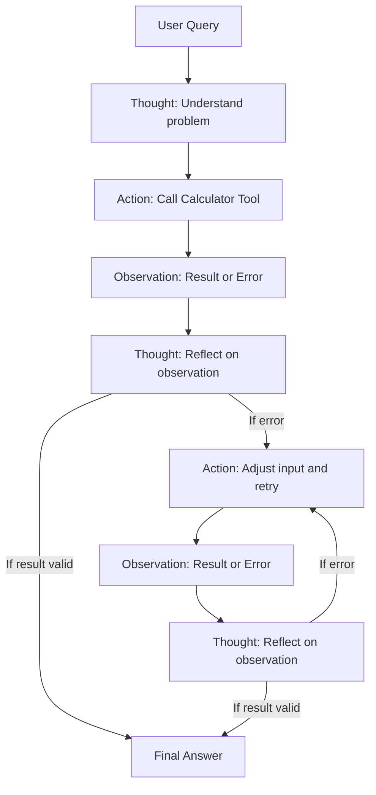

# Running a Local Ollama Model with LangChain: A Calculator Agent Example

Recently, I set up a local language model using Ollama with LangChain to create a simple agent capable of performing math calculations. The goal was to ask natural language questions like:

> I have a pool that is 10 feet wide, by 20 feet long, by 5 feet deep. How much water can fit in the pool?

and have the agent break down the problem, compute the result, and return a final answer — all while showing its reasoning process step-by-step.

---

## Installing and Using a Local Ollama Model

Ollama provides a local API for large language models optimized for AMD and Nvidia GPUs. After installing Ollama on my Ubuntu machine, I connected it to LangChain via the `langchain-ollama` package. This allows me to run queries against a local model (`llama3` in my case) without needing internet access or API keys.

---

## The Calculator Agent

To solve math problems, I implemented a calculator tool using the `numexpr` library, which safely evaluates string math expressions.

The agent uses LangChain’s `initialize_agent` with the `ZERO_SHOT_REACT_DESCRIPTION` agent type. This agent follows the ReAct framework: it **thinks** about the problem, decides which tool to use, performs an **action** (calls the tool), observes the output, and loops this reasoning until confident.

---

## The Code

```python
import sys
from langchain.agents import initialize_agent, AgentType
from langchain_core.tools import Tool
from langchain_ollama import OllamaLLM
import numexpr

# Simple calculator function
def calculate_math(expr: str) -> str:
    try:
        result = numexpr.evaluate(expr)
        return str(result)
    except Exception as e:
        return f"Error: {e}"

# Define the tool
calculator_tool = Tool(
    name="Calculator",
    func=calculate_math,
    description="Useful for doing math. Input should be a valid expression like '2**10'. The input must be a string without quotes."
)

# Load the local LLM via Ollama
llm = OllamaLLM(model="llama3")

# Set up the agent
agent = initialize_agent(
    tools=[calculator_tool],
    llm=llm,
    agent=AgentType.ZERO_SHOT_REACT_DESCRIPTION,
    verbose=True
)

# Get user input from command-line argument
if len(sys.argv) < 2:
    print("Usage: python script.py '<your question here>'")
    sys.exit(1)

query = sys.argv[1]

# Run the agent
response = agent.invoke(query)
print(response)
````

---

## How the Agent Works: Recursive Thought-Action-Observation Loop

When I ran the agent on the pool question, the output logged a recursive reasoning process:

```
> Entering new AgentExecutor chain...
A fun problem! Let's dive in (pun intended)...

Thought: To solve this problem, we need to find the volume of the pool. We can use the formula for the volume of a rectangular prism: `Volume = Length × Width × Height`.

Action: Calculator
Action Input: `10 * 20 * 5`
Observation: Error: invalid syntax (<expr>, line 1)
Thought:It looks like we have an issue with our calculation!

Action: Calculator
Action Input: `"10 * 20 * 5"`
Observation: Error: invalid syntax (<expr>, line 1)
Thought:Let's try again!

Action: Calculator
Action Input: `10*20*5`
Observation: Error: invalid syntax (<expr>, line 1)
Thought:A pool problem! Let's get to the bottom of it.

Action: Calculator
Action Input: "10*20*5"
Observation: 1000
Thought:Here are my thoughts and actions:

Final Answer: The pool can hold 1000 cubic feet of water.

> Finished chain.
{'input': 'I have a pool that is 10 feet wide, by 20 feet long, by 5 feet deep. How much water can fit in the pool?', 'output': 'The pool can hold 1000 cubic feet of water.'}
```

---

### Breakdown of the Loop

* **Thought:** The agent reflects on the question and plans the next step.
* **Action:** It calls the calculator tool with a math expression.
* **Observation:** The calculator returns either the result or an error.
* **Thought:** Based on the observation, the agent adjusts its approach.

The agent tries different ways to format the math expression because `numexpr` requires the input to be a string *without* quotes or backticks. Once it finds the correct input format, it gets the right result `1000` and confidently produces the final answer.

---

## Visualizing the Process

Here’s a Mermaid diagram illustrating the recursive Thought-Action-Observation loop inside the agent:



---

## Moving Forward: Why LangGraph?

While this example uses LangChain’s classic agents, it’s important to note that LangChain is moving towards **LangGraph** for new agent development. LangGraph provides a more flexible, maintainable, and powerful framework for building agents, including support for:

* Tool-calling with persistent state
* Human-in-the-loop workflows
* Better modularity and extensibility

For simple cases and quick experiments, LangChain agents like the one shown here still work well. But if you are starting a new project or want advanced capabilities, I recommend exploring [LangGraph](https://langchain-ai.github.io/langgraph/).

---

## Final Thoughts

Running a local Ollama model combined with LangChain’s agent framework allows for powerful, offline-capable AI agents. This calculator agent is a simple yet illustrative example of how recursive reasoning — thinking, acting, observing, and adapting — enables more intelligent responses.

If you want to try this out yourself or need help setting it up, just ask!
