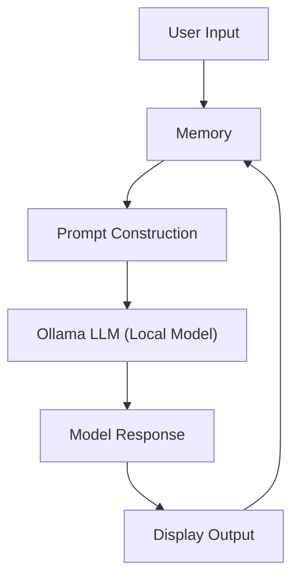

# Building a Minimal Local Chatbot with LangChain and Ollama

LangChain has quickly become a go-to framework for building LLM-powered applications. When paired with [Ollama](https://ollama.com)—a tool for running LLMs locally—it becomes possible to create a fully offline chatbot that uses local resources, giving you more control over privacy, speed, and cost.

In this post, I’ll walk through how to build a minimal chatbot in Python using:

- A local LLM served by Ollama (such as `llama3`)
- LangChain’s `ConversationChain` abstraction
- Basic conversational memory
- No external APIs or tools—just local compute

This post is targeted at developers who are comfortable with Python and want to better understand how LangChain handles conversation and memory internally.

---

## Why Ollama?

Ollama is a lightweight, user-friendly tool that runs open-source LLMs like `llama3`, `mistral`, or `codellama` locally on your machine. You can think of it as a server that makes your local model accessible through an API endpoint (usually at `http://localhost:11434`).

This is incredibly useful for privacy-conscious applications, edge computing, and offline environments.

To follow along, make sure you’ve installed a model with Ollama, like this:

```bash
ollama pull llama3
````

And make sure the server is running:

```bash
ollama run llama3
```

---

## The Minimal Chatbot

Here’s the core Python code:

```python
from langchain_ollama import OllamaLLM
from langchain.chains import ConversationChain
from langchain.memory import ConversationBufferMemory

# Connect to the local Ollama model
llm = OllamaLLM(model="llama3")

# Store the full chat history as plain text
memory = ConversationBufferMemory()

# Create a conversational agent
chatbot = ConversationChain(
    llm=llm,
    memory=memory,
    verbose=False
)

# Chat loop
print("Chatbot (type 'exit' to quit)\n")
while True:
    user_input = input("You: ")
    if user_input.strip().lower() in {"exit", "quit"}:
        break
    try:
        response = chatbot.predict(input=user_input)
        print("Bot:", response)
    except Exception as e:
        print(f"Error: {e}")
```

---

## How It Works

Let’s unpack each piece of this setup.

### `OllamaLLM`

This is a LangChain wrapper for the local Ollama model. Under the hood, it sends prompts to `http://localhost:11434` and parses the responses.

```python
llm = OllamaLLM(model="llama3")
```

This line creates an LLM instance connected to the `llama3` model.

### `ConversationBufferMemory`

LangChain needs a way to remember what’s been said so it can generate contextually appropriate responses. This memory object stores every turn of the conversation in plain text format, like this:

```
You: Hi there
Bot: Hello! How can I help?
You: What's the weather?
```

The entire conversation is prepended to each new prompt and sent to the LLM.

```python
memory = ConversationBufferMemory()
```

This is the simplest form of memory—ideal for short or demo chats. However, it grows indefinitely, which can eventually exceed your model's context window.

### `ConversationChain`

This LangChain abstraction wraps the LLM and memory together into a single interface:

```python
chatbot = ConversationChain(llm=llm, memory=memory)
```

When you call:

```python
response = chatbot.predict(input=user_input)
```

LangChain constructs a new prompt by combining the memory (chat history) and the current user input. It sends that full prompt to the LLM and returns the generated output.

---

## LangChain Chatbot Architecture

Here’s a visual breakdown of how this setup flows, using Mermaid:



Each turn goes through memory, gets formatted into a prompt, passed to the model, and then both the response and the user input are stored back into memory.

---

## Managing Context Length

Every LLM has a **maximum context window**, measured in tokens. For example:

* `llama3:8b` supports around **8,000 tokens**
* `llama3:70b` can handle even more (16k–32k tokens)

LangChain does **not** automatically manage this limit when using `ConversationBufferMemory`. As your conversation grows, eventually the prompt may exceed the context window, causing the model to truncate input or fail.

### Solution: Limit Memory by Token Count

To avoid this, use `ConversationTokenBufferMemory`, which trims old messages based on token count:

```python
from langchain.memory import ConversationTokenBufferMemory

memory = ConversationTokenBufferMemory(
    llm=llm,
    max_token_limit=3000  # Adjust as needed for your model
)
```

This ensures only the most recent parts of the conversation are retained in memory, keeping you under the model's token limit.

---

## Possible Improvements

This setup is intentionally minimal, but you can extend it in several directions:

| Feature             | How to Add It                                   |
| ------------------- | ----------------------------------------------- |
| Web UI              | Use Gradio or Streamlit for a friendly frontend |
| Long-Term Memory    | Add vector stores like Chroma or FAISS          |
| File Uploads        | Add tools to read and summarize documents       |
| Multi-turn Tools    | Use LangChain agents with external APIs/tools   |
| Streaming Responses | Stream LLM outputs for better UX                |

You can also build a more advanced system using LangChain’s `AgentExecutor`, but that’s beyond the scope of this minimal example.

---

## Final Thoughts

LangChain and Ollama make it incredibly simple to get started with local LLMs in a chatbot context. This setup is great for demos, experimentation, and lightweight applications. However, for production or heavy use, you’ll need to manage context length and potentially introduce more efficient memory strategies.

If you're interested in building more powerful chatbots—like those that can read documents, retrieve from databases, or act as assistants—LangChain provides all the building blocks. But this minimal setup is a great foundation to build on.

---

**References**:

* [LangChain Documentation](https://docs.langchain.com/)
* [Ollama Documentation](https://ollama.com/)
